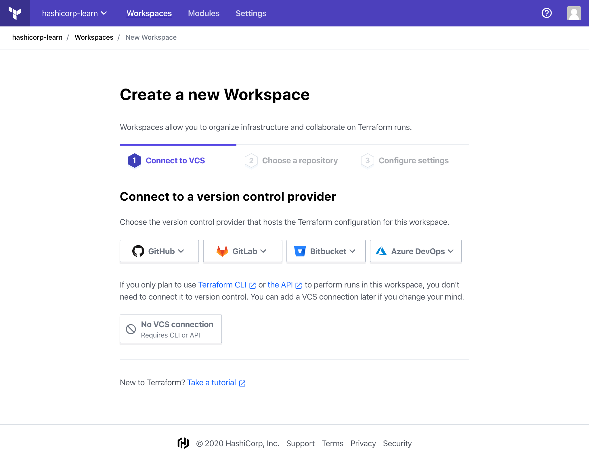
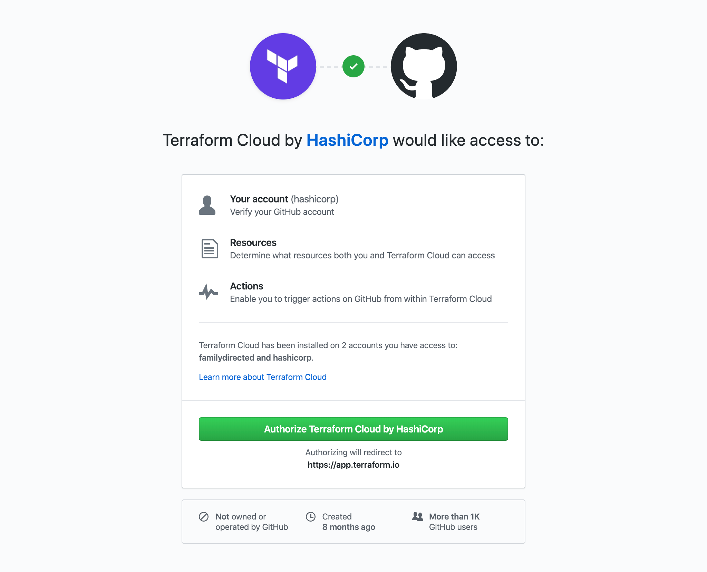
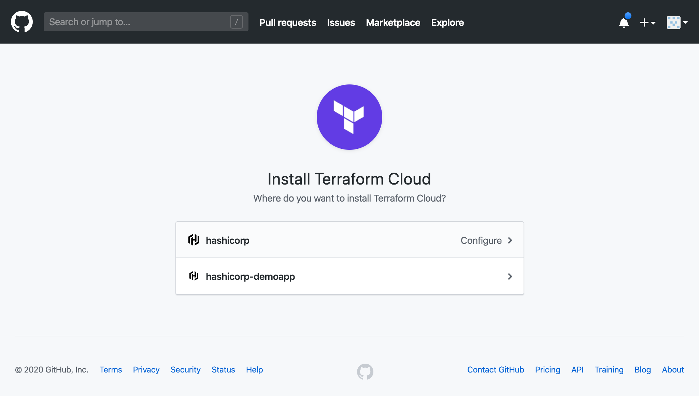
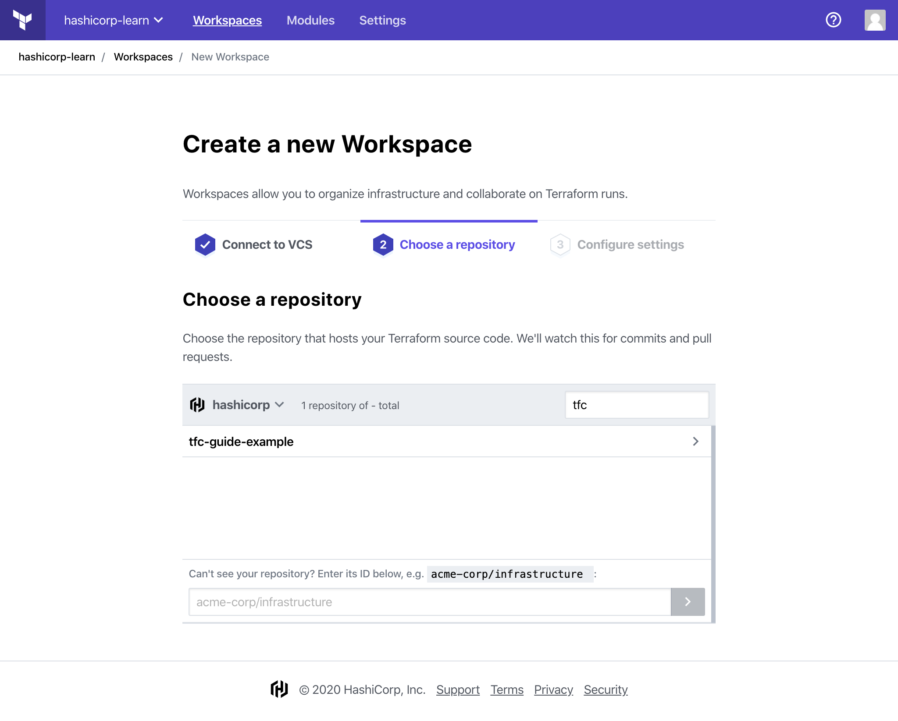
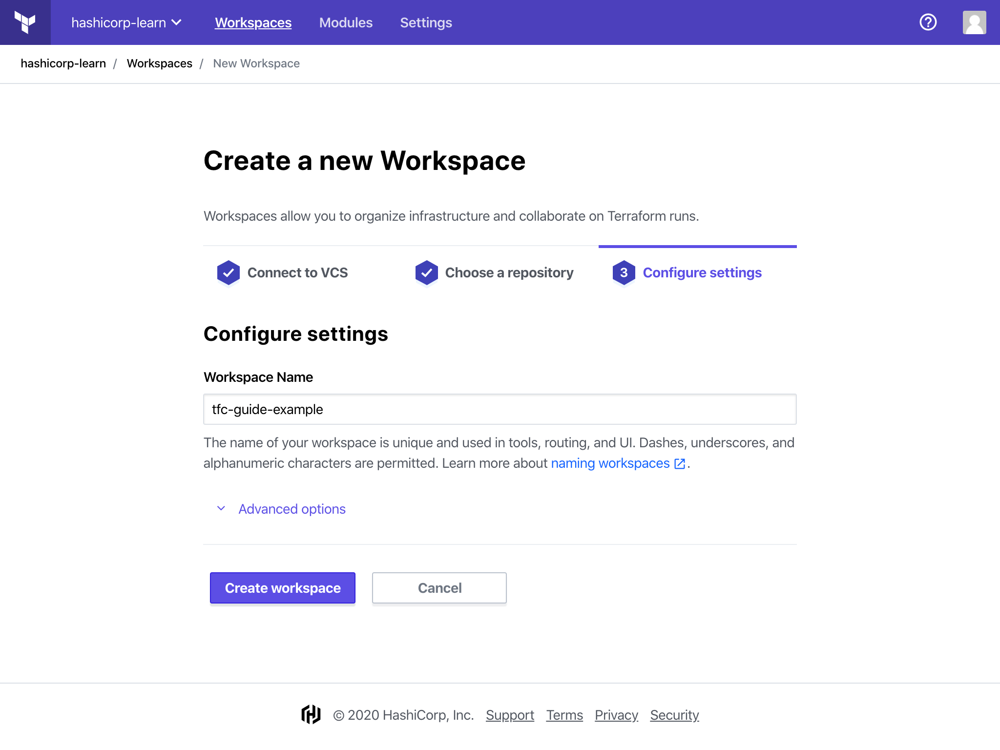
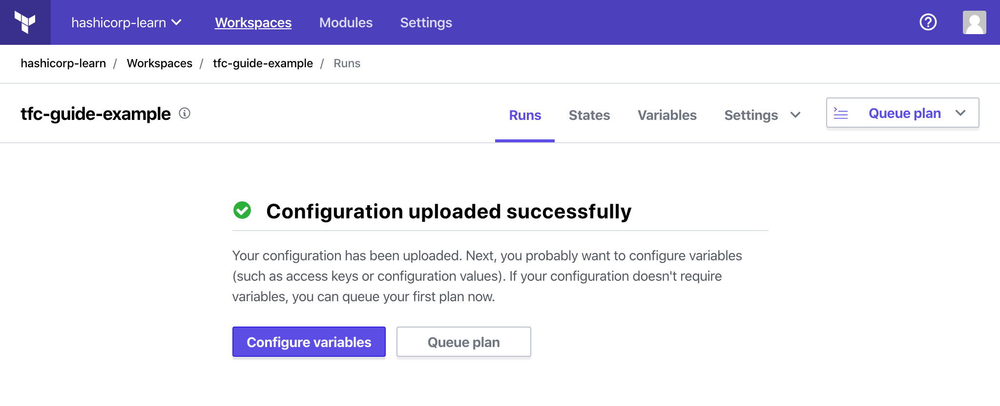

# Create a Workspace

In this guide, you will create your first version control system \(VCS\) enabled workspace with GitHub. This will enable you to collaborate with your team on Terraform configurations. You will learn how to create a Terraform Cloud workspace by connecting a VCS repository to Terraform Cloud.

### Fork a Github repository

Visit [the Terraform Cloud example repository](https://github.com/hashicorp/tfc-guide-example) and click the "Fork" button at the top right of the page to create a fork of the repository into your account.

### Connect to GitHub

If you've just signed up with Terraform Cloud and created a new organization, the first page you'll see is the "New Workspace" page. You can also create a new workspace by choosing "Workspaces" from the main menu, and then the "New Workspace" button.

On the "New Workspace" page, select "GitHub" and then choose "GitHub.com" from the drop-down to continue.

A new window will open asking you to authorize Terraform Cloud to use your GitHub account. Click the green "Authorize" button to connect Terraform Cloud to your GitHub account.

You may be asked to install Terraform Cloud for your GitHub account/organization. If prompted, select your account/organization to install Terraform Cloud.

For information about installing Terraform Cloud on GitHub, refer to the [Terraform Documentation: Configuration-Free GitHub Usage](https://www.terraform.io/docs/cloud/vcs/github-app.html#installing).

### Choose a repository

Next, you will see a list of your GitHub repositories. Choose the repository you forked in the first step. If you have a lot of GitHub repositories, you may need to filter the list to find the correct one.

### Create the workspace

On the final step, leave the workspace name and "Advanced options" unchanged, and click the purple "Create workspace" button to create the workspace.

It will take a few minutes for Terraform Cloud to connect to your GitHub repository. Once that's complete, you should see a notification that your configuration was uploaded successfully.

