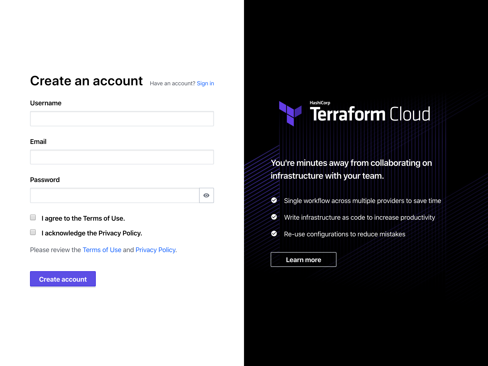
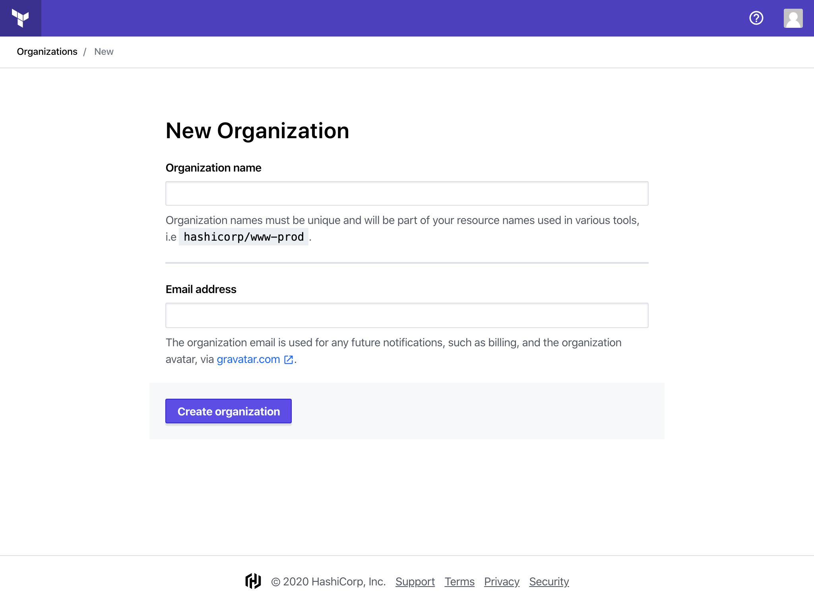

# Sign up for Terraform Cloud

### **Prerequisites**

While Terraform can provision resources on many different providers and connect with several popular version control systems \(VCSs\), this guide requires:

* an AWS account
* a GitHub account

### **The workflow**

Terraform Cloud offers a team-oriented remote Terraform workflow.

Users are individual members of a Terraform Cloud [organization](https://www.terraform.io/docs/cloud/users-teams-organizations/organizations.html). As a user, you manage, plan and apply collections of infrastructure in [workspaces](https://www.terraform.io/docs/cloud/workspaces/index.html). These workspaces contain Terraform configuration files, environment variables, Terraform variables, and state files — everything Terraform needs to manage a given collection of infrastructure.

A common workflow is:

1. **Author** - Create or update the configuration file in HCL based on the scoped parameters
2. **Select workspace** - Create or select a workspace for your resources
3. **Version Control** - Check your configuration files into a version control system \(VCS\) as a central source of truth where your changes can be managed
4. **Configure Variables** - Define your workspace's [Terraform variables](https://www.terraform.io/docs/configuration/variables.html) and environment variables
5. **Plan & Apply** - Execute Terraform Cloud runs \(plans and applies\) to manage your infrastructure

Since Terraform Cloud supports multiple users, you can collaborate with your team on each of these steps. For instance, each time you plan a new change, your team can see and approve the plan before it is applied.

### Create your account

Create a Terraform Cloud account at [https://app.terraform.io/signup/account](https://app.terraform.io/signup/account).

When you sign up, you'll also receive an email asking you to confirm your email address. Confirm your email address before moving on.

For more information about account creation, refer to the [Terraform Documentation: Creating an account](https://www.terraform.io/docs/cloud/users-teams-organizations/users.html#creating-an-account).

For information about accessing Terraform Cloud with the CLI or API, refer to the [Terraform Cloud API Documentation](https://www.terraform.io/docs/cloud/api/index.html).

### Create your organization

Terraform Cloud will prompt you to create a new organization after you sign in for the first time.

Enter an organization name and email address. You can use the same email address that you used for your account.

**Note:** If you want to join an existing organization, give the organization's administrator the email address you used to create an account. They will be able to send you an invite.

For more information about organization creation, refer to the [Terraform Documentation: Creating Organizations](https://www.terraform.io/docs/cloud/users-teams-organizations/organizations.html#creating-organizations).

