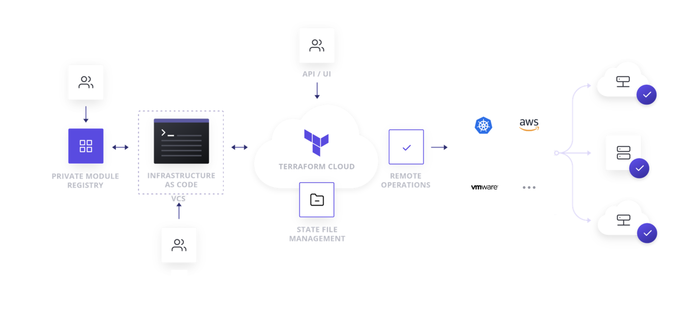

# Terraform Cloud Introduction

Terraform Cloud is an application that helps teams use Terraform together,it helps you collaborate on infrastructure. It manages Terraform runs in a consistent and reliable environment, and includes easy access to shared state and secret data, access controls for approving changes to infrastructure, a private registry for sharing Terraform modules, detailed policy controls for governing the contents of Terraform configurations, and more.

Terraform Cloud is available as a hosted service at [https://app.terraform.io](https://app.terraform.io). We offer free accounts for small teams, and paid plans with additional feature sets for medium-sized businesses.

Large enterprises can purchase Terraform Enterprise, our self-hosted distribution of Terraform Cloud. It offers enterprises a private instance of the Terraform Cloud application, with no resource limits and with additional enterprise-grade architectural features like audit logging and SAML single sign-on.

### About Product Names

Before mid-2019, all distributions of Terraform Cloud used to be called Terraform Enterprise; the self-hosted distribution was called Private Terraform Enterprise \(PTFE\). These previous names sometimes still appear in supporting tools \(like [the `tfe` Terraform provider](https://registry.terraform.io/providers/hashicorp/tfe/latest), which is also intended for use with Terraform Cloud\).

