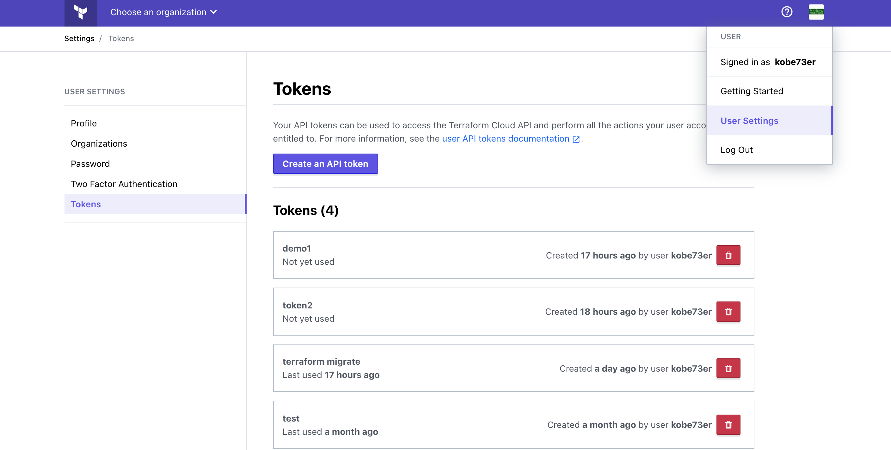

# Migrate State to Terraform Cloud

As a current user of the Terraform CLI, you are responsible for maintaining a [state](https://www.terraform.io/docs/state/index.html) file as a source of truth for your cloud infrastructure. You can migrate your local state file to Terraform Cloud without interrupting or recreating your existing infrastructure.

**Warning:** When uploading a state file to Terraform Cloud using the steps in this guide, always use the same version of the Terraform CLI you used to create the resources. Using a newer version of Terraform may update the state file and cause state file corruption.

This guide assumes that you have the following:

* The [Terraform CLI](https://learn.hashicorp.com/terraform/getting-started/install) installed locally
* A [Terraform Cloud](https://app.terraform.io/) account

**Note:** Because the `remote` backend was not supported in older version of Terraform, you must use 0.11.13 or higher in order to migrate your state to Terraform Cloud. The snippets in this guide use 0.12 syntax.

### Create state

Start by cloning [this GitHub repository](https://github.com/hashicorp/learn-state-migration).

```text
$ git clone https://github.com/hashicorp/learn-state-migration
```

Next, change into the directory.

```text
$ cd learn-state-migration
```

Review the `main.tf` file in the working directory to get an overview of the resources you are about to create. This configuration uses the `random_pet` resource to generate and output a random pet name with a given number of words. The length of the name is determined by the value of the `name_length` variable, which defaults 3.

In a real-world configuration you may have additional variables such as cloud platform credentials defined in a `.tfvars` file. We'll cover how to set these values in the Terraform Cloud workspace later on in this guide, after you've migrated the state file.

```text
## Terraform configuration

variable "name_length" {
  description = "The number of words in the pet name"
  default     = "3"
}

resource "random_pet" "pet_name" {
  length    = var.name_length
  separator = "-"
}

output "pet_name" {
  value = random_pet.pet_name.id
}
```

Initialize the directory.

```text
$ terraform init
```

After Terraform initializes, apply the configuration and approve the run by typing "yes" at the prompt.

```text
$ terraform apply
```

Terraform will output a three word randomly generated pet name.

### Set up the remote backend

Now that you have a local state file, you need to create a _backend_ code block in your configuration. Backends tell Terraform where to load and save its state file.

Terraform uses the local backend by default if you do not explicitly define a backend code block in your configuration. The local backend saves your state as a `terraform.tfstate` file in the directory where you run `terraform apply`. To migrate state files to Terraform Cloud, define a `remote` backend in your configuration by adding a new code block to the beginning of your `main.tf` file.

```text
terraform {
  backend "remote" {
    hostname      = "app.terraform.io"
    organization  = "<YOUR-ORG-NAME>"

    workspaces {
      name = "state-migration"
    }
  }
}
```

Replace the organization and workspaces attribute values with the name of your Terraform Cloud organization and desired workspace name. While the organization defined in the backend stanza **must** already exist, the workspace does not have to; Terraform Cloud will create it if necessary. If you opt to use a workspace that already exists, the workspace must not have any existing states.

**Note:** If you are familiar with running Terraform using the CLI, you may have used Terraform workspaces. Terraform Cloud workspaces behave differently than Terraform CLI workspaces. Terraform CLI workspaces allow multiple state files to exist within a single directory, enabling you to use one configuration for multiple environments. Terraform Cloud workspaces contain everything needed to manage a given set of infrastructure, and function like separate working directories.

### Authenticate with Terraform Cloud

Now that you have defined your backend, you must authenticate with Terraform Cloud in order to proceed with initialization. In order to authenticate with Terraform Cloud, you should open page below to generate an API Token first



Click to create an API token button and give it a name.


Click "Create API token" and Terraform Cloud will generate the authentication token.


Save a copy of the token in a secure location as it provides access to your Terraform Cloud organization.

We should save it in CLI Configuration File \(`.terraformrc` or `terraform.rc`\).

* On Windows, the file must be named named `terraform.rc` and placed in the relevant user's `%APPDATA%` directory. The physical location of this directory depends on your Windows version and system configuration; use `$env:APPDATA` in PowerShell to find its location on your system.
* On all other systems, the file must be named `.terraformrc` \(note the leading period\) and placed directly in the home directory of the relevant user.

For more reference about the CLI configuration file, you can visit [this page](https://www.terraform.io/docs/commands/cli-config.html#credentials).

The content in your CLI configuration file should be like this below, notice, you should replace the token value with your own which is the one you just created.

```text
credentials "app.terraform.io" {
  token = "xxxxxx.atlasv1.zzzzzzzzzzzzz"
}
```

### Migrate the state file

Once you have authenticated the `remote` backend, you're ready to migrate your local state file to Terraform Cloud. To begin the migration, reinitialize. This causes Terraform to recognize your changed backend configuration.

```text
$ terraform init

Initializing the backend...
Acquiring state lock. This may take a few moments...
Do you want to copy existing state to the new backend?
  Pre-existing state was found while migrating the previous "local" backend to the
  newly configured "remote" backend. No existing state was found in the newly
  configured "remote" backend. Do you want to copy this state to the new "remote"
  backend? Enter "yes" to copy and "no" to start with an empty state.

  Enter a value:
```

During reinitialization, Terraform presents a prompt saying that it will copy the state file to the new backend. Enter "yes" and Terraform will migrate the state from your local machine to Terraform Cloud.

### Configure the Terraform Cloud workspace

After migrating your state to Terraform Cloud, log in to the [Terraform Cloud web UI](https://app.terraform.io/), find your workspace name as defined in your backend configuration, and click on it. Navigate to the "States" tab of the workspace, and see your first action within the workspace.


Remember that your configuration has a variable that you need to add to the new workspace. Click the "Variables" tab in the workspace and then "Add variable". Enter the name of the variable, `name_length`, as the key. Then enter a new value, `5`, and save the variable.


For real-world configurations, add cloud platform credentials and any other configuration variables to the workspace as well.

### [»](https://learn.hashicorp.com/terraform/tfc/tfc_migration#initiate-a-run-in-the-new-workspace)Initiate a run in the new workspace

After verifying that the state was migrated to the Terraform Cloud workspace, remove the local state file.

```text
$ rm terraform.tfstate
```

Apply a new run.

```text
$ terraform apply
```

Terraform will stream logs from Terraform Cloud and provide a link to the run in the Terraform Cloud UI. You set a new value for the `name_length` variable, so the resource will be replaced with one matching the new parameters.


